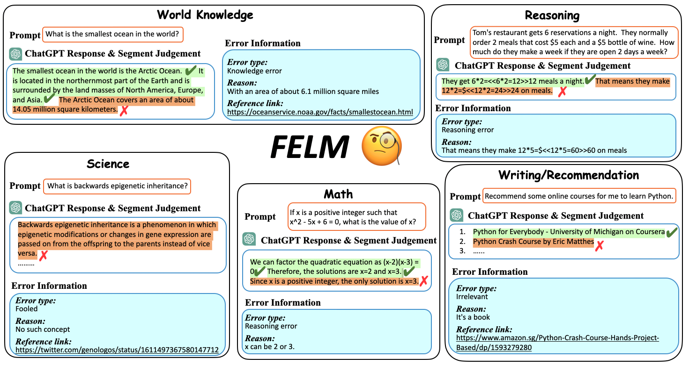

# FELM

**🎉 🎉 🎉Our paper is accepted by NeurIPS Datasets and Benchmarks track 2023 and will be on Arxiv soon!!** 

 FELM is a benchmark for factuality evaluation of large language models.

  We consider five distinct domains: world knowledge, science/technology, writing/recommendation, reasoning, and math in FELM. We gather prompts corresponding to each domain by various sources including standard datasets like truthfulQA, online platforms like Github repositories, ChatGPT generation or drafted by authors. We then obtain responses from ChatGPT for these prompts. 

  For each response, we employ fine-grained annotation at the segment level, which includes reference links, identified error types, and the reasons behind these errors as provided by our annotators. This benchmark is designed to function as a meta-metric for evaluating the performance of factuality detectors in large language models.


## Data Description
#### Overview
#### Dataset Snapshot

Category | Data
--- | ---
Number of Instances | 847
Number of Fields | 5
Labeled Classes | 2
Number of Labels | 4427

#### Descriptive Statistics


Statistic | All | world_knowledge | Reasoning | Math | Science/tech | Writting/Recommendation 
--- | --- | --- | --- | --- | --- | ---
Segments | 4427 | 532  | 1025 | 599 | 683 |  1588
Positive segments | 3642 | 385  | 877 | 477 | 582 |1321 
Negative segments |785 | 147  | 148 | 122 | 101 | 267  

#### Data Fields

| Field Name  | Field Value | Description                                 |
| ----------- | ----------- | ------------------------------------------- |
| index         | Integer     | the order number of the data point          |
| source   | string      | the prompt source   |
| prompt           | string      | the prompt for generating response                   |
| response           | string      | the response of ChatGPT for prompt                  |
| segmented_response           | list      | segments of reponse                   |
| labels          | list      | factuality labels for segmented_response                  |
| comment      | list      | error reasons for segments with factual error  |
| type | list      |  error types for segments with factual error        |
| ref | list      |  reference links       |


#### Typical Data Point


```
{"index": "0", 
 "source": "quora", 
 "prompt": "Which country or city has the maximum number of nuclear power plants?", 
 "response": "The United States has the highest number of nuclear power plants in the world, with 94 operating reactors. Other countries with a significant number of nuclear power plants include France, China, Russia, and South Korea.",
 "segmented_response": ["The United States has the highest number of nuclear power plants in the world, with 94 operating reactors.", "Other countries with a significant number of nuclear power plants include France, China, Russia, and South Korea."], 
 "labels": [false, true],
 "comment": ["As of December 2022, there were 92 operable nuclear power reactors in the United States.", ""], 
 "type": ["knowledge_error", null], 
 "ref": ["https://www.eia.gov/tools/faqs/faq.php?id=207&t=3"]}

```
#### Evaluation on FELM
environment requirement:
```
transformers 4.32.0
openai 0.27.8
tenacity 8.2.2
tokenizer 3.4.2
pandas 2.0.3
```
to reproduce our results:
```
cd eval
bash eval.sh
#replace 'Your OPENAI KEY' with your openai api key if using GPT-3.5 or GPT-4
```


#### LEADBOARD (in segment level)

| Model | F1 score | Balanced accuracy                                |
| ----------- | ----------- | ------------------------------------------- |
| GPT4         | 48.3     |   67.1        |
| Vicuna-33B   | 32.5      | 56.5   |
| ChatGPT           | 25.5      | 55.9                   |

We only report the highest score in this table.


## Download

- Method 1: Download the zip file then unzip it:
  ```
  git clone https://github.com/SJTU-LIT/felm.git
  ```
- Method 2: Directly load the dataset using [Hugging Face datasets](https://huggingface.co/datasets/sjtu-lit/felm):

  ```python
  from datasets import load_dataset
  dataset=load_dataset(r"sjtu-lit/felm",'wk')
  print(dataset['test'][0])
  
  ```


## Licenses

[](https://lbesson.mit-license.org/)

This work is licensed under a [MIT License](https://lbesson.mit-license.org/).

[](http://creativecommons.org/licenses/by-nc-sa/4.0/)

The FELM dataset is licensed under a
[Creative Commons Attribution-NonCommercial-ShareAlike 4.0 International License](http://creativecommons.org/licenses/by-nc-sa/4.0/).


